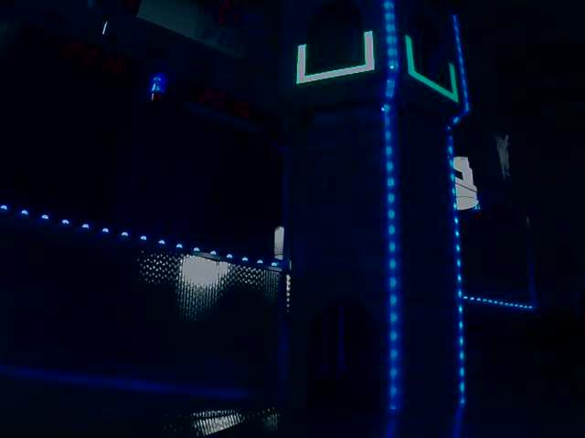
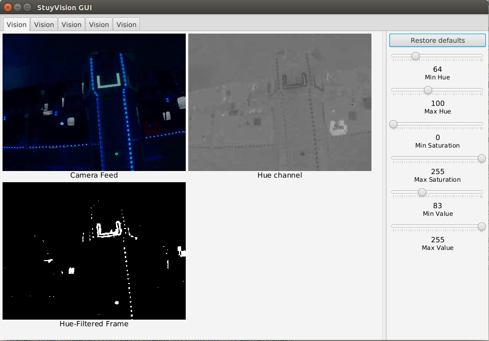
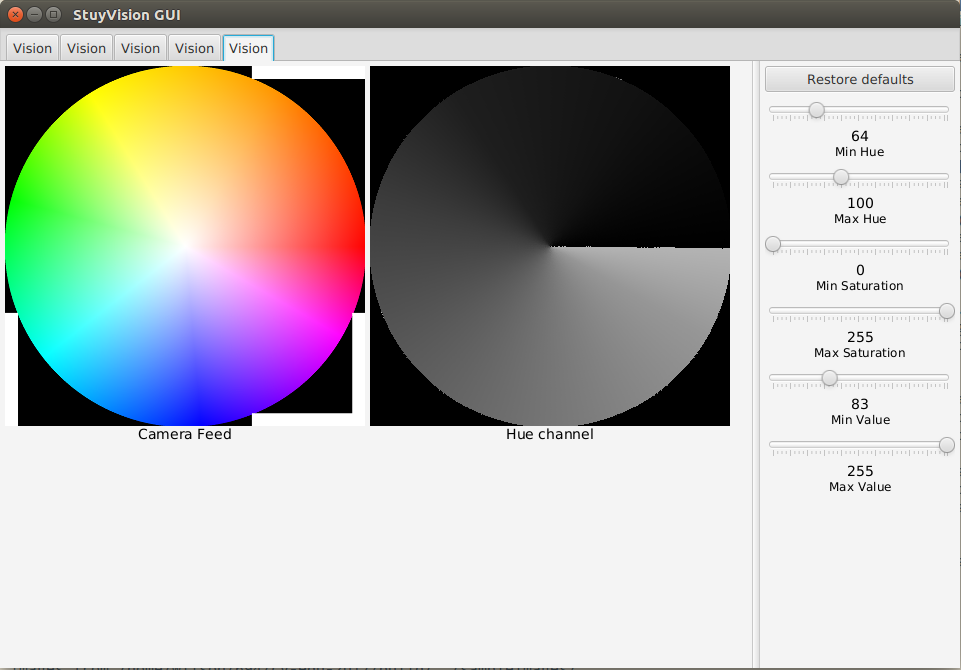
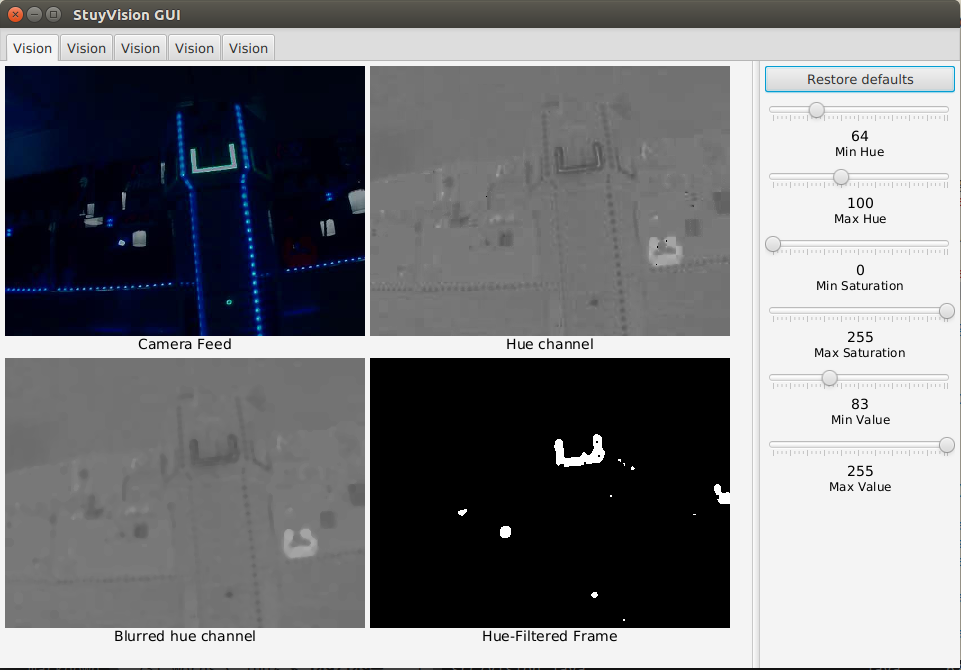
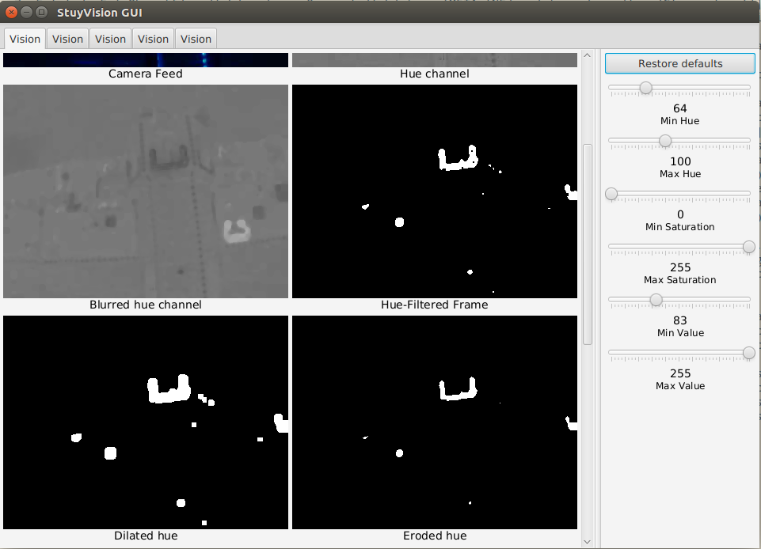

# cv-edu-2017

CV Education for the 2017 season

OpenCV needs to be installed at `lib/opencv-3.0.0`.

On Linux, you can install OpenCV with the
`install-opencv-unix.sh` script.  There are more detailed
instructions on this in [the README of
github.com/Team694/stuyvision-lib](https://github.com/Team694/stuyvision-lib#installing-opencv-on-your-machine).
Once CV is setup, run `make` to compile and then `make run` to run the project.
To set up on Windows, see `windows-setup.md` for instructions.

## Reference

- ReadTheDocs [tutorials](http://opencv-java-tutorials.readthedocs.io/en/latest/02-first-java-application-with-opencv.html)
  for OpenCV with Java (and GUIs with JavaFX).

- Official OpenCV 3.1.0 [JavaDocs](http://docs.opencv.org/java/3.1.0/).

- Official OpenCV 3.1.0 [documentation](http://docs.opencv.org/3.1.0/). This has
  much more detail than the JavaDocs, but is intended for
  those using OpenCV with C++. There are no examples in Java
 (all are C/C++).

More resources
[here](https://github.com/Team694/stuyvision-lib#other-cv-resources), in
stuyvision-lib.

### Working on the school desktops

To develop on the desktops, log in to either a Guest session or your own
account, then clone this repo and set up your environment:

```bash
$ git clone https://github.com/Team694/cv-edu-2017
$ cd cv-edu-2017
$ source setup-workstation.sh
```

As usual, use `make` to build:

```bash
$ make
# code compiles
$ make run
# code runs. Ctrl-C to interrupt (like force quit)
```

If you encounter an error while running `make run` similar to the one below:

```
Exception in thread "main" java.lang.UnsatisfiedLinkError: /path/to/cv-edu-2017/lib/opencv-3.0.0/build/lib/libopencv_java300.so: libopencv_photo.so.3.0: cannot open shared object file: No such file or directory
```

you may need to run the command:

```bash
$ export LD_LIBRARY_PATH=/path/to/cv-edu-2017/lib/opencv-3.0.0/build/lib/
```

### StuyVision methods:

#### void postImage(Mat frame, String label);

`postImage` puts an image to the screen with a specified label. E.g.:

```java
postImage(frame, "Camera Frame");
```

#### boolean hasGui();

Returns whether your code is being run with a GUI. Useful for writing
code that posts images to a GUI when there is one, but still works
when there is no GUI.

```java
if (hasGui()) {
    postImage(frame, "Camera Frame");
}
```

#### boolean postTag(String imageLabel, String tagKey, String tagValue);

Adds a tag beneath the image labelled `imageLabel`.

`tagKey` is the label of the tag. If you call `postTag` multiple times with the
same `imageLabel` and `tagKey`, it replaces the old tag value with `tagValue`.

This is useful for displaying information about your frames. For example, if
you were calculating the distance to an object, you might want to show the
distance your code has calculated below the image.

```java
postTag("Filtered frame", "Number of contours", Integer.toString(numberOfContours));
```

### OpenCV functions:

Unless otherwise stated, you can pass the same Mat as an `input` parameter and
an `output` parameter, to overwrite the original Mat.

#### void Imgproc.cvtColor(Mat input, Mat output, int code);

Convert the color representation of `input`, and save it in `output`.

`code` is a constant representing what conversion to make, like
`Imgproc.COLOR_BGR2HSV` which says to convert from BGR to HSV. You can also
convert to and much more, by using different constants. The conversion
constants are enumerated in the [Imgproc
JavaDocs](http://docs.opencv.org/java/3.1.0/index.html?org/opencv/imgproc/Imgproc.html).

#### void Core.split(Mat frame, ArrayList<Mat> channels);
```java
ArrayList<Mat> channels = new ArrayList<Mat>();
Core.split(myFrame, channels);
// The first channel is channels.get(0), the second is channels.get(1), etc.
```

#### void Core.merge(ArrayList<Mat> channels, Mat frame);

Merge individual channels into a single multi-channel frame.

```java
ArrayList<Mat> channels = new ArrayList<Mat>();
// ... do stuff with channels...
Mat merged = new Mat();
Core.merge(channels, merged);
```

#### void Core.inRange(Mat input, Scalar lowerBound, Scalar upperBound, Mat output);

Filters the `input` into `output`. A given pixel in `output` is white
(numerically, 255) if the corresponding input pixel is between `lowerBound` and
`upperBound`; it is black otherwise (numerically, 0).

```java
Core.inRange(hueChannel, new Scalar(80), new Scalar(100), filteredHueChannel);
```

#### bitwise operations

There are several bitwise-operation methods. These do logical operations (like
AND, OR, NOT) on the pixel values of two Mats. A white pixel is all 1-bits,
a black pixel is all 0-bits. So, ANDing a white and a black pixel, for example,
results in a black pixel.

- `void Core.bitwise_and(Mat input1, Mat input2, Mat output);`
- `void Core.bitwise_or(Mat input1, Mat input2, Mat output);`
- `void Core.bitwise_not(Mat input, Mat output);`
- `void Core.bitwise_xor(Mat input1, Mat input2, Mat output);`

  XOR is "exclusive or". This means OR, but not AND.

For example, you can filter the hue channel and the value channel, and then
`bitwise_and` them together with Core.bitwise_and to get a Mat filtered by both
hue and value.

**These only work if each input Mat has the same number of channels**

#### erode and dilate

```java
Mat Imgproc.getStructuringElement(int shape, Size kernelSize);
void Imgproc.erode(Mat input, Mat output, Mat kernel);
void Imgproc.dilate(Mate input, Mat output, Mat kernel);
```

There is more explanation of erode and dilate below (the
"December 15 Lesson" section).

#### void Imgproc.findContours(Mat image, ArrayList<MatOfPoint> contours, Mat hierarchy, int mode, int method);

Finds contours in `image` using the method specified by `method`, and
adds them to the list `contours`. Each contour is a `MatOfPoint`, which
is a matrix of points.

If you don't want to use the hierarchy, you can pass a `new Mat()`.

E.g., find contours with rectilinear boundaries:

```java
ArrayList<MatOfPoint> contours = new ArrayList<MatOfPoint>();
Imgproc.findContours(filteredImage, contours, new Mat(), Imgproc.RETR_EXTERNAL, Imgproc.CHAIN_APPROX_SIMPLE);
```

Now each member of `contours` is a contour, represented as a `MatOfPoint`.

#### MatOfPoint, MatOfPoint2f

A `MatOfPoint` is a matrix of `Point`s. A `Point` has integer coordinates.

A `MatOfPoint2f` is a matrix of `Point2f`s. A `Point2f` has floating point coordinates.

In certain cases these are basically used as lists of points.


Methods:
- `myMatOfPoints.convertTo(otherMat, conversion)` -- convert the `MatOfPoint` to another type.
  In particular, you'll probably use the following conversion to convert a `MatOfPoint`
  to a `MatOfPoint2f`:

  `myMatOfPoints.convertTo(myMatOfPoint2f, CvType.CV_32FC1);`

#### void Imgproc.minEnclosingCircle(MatOfPoint2f points, Point center, float[] radius);

This determines the center and radius of the smallest circle that encloses all
of the points in `points`.

The only *input parameter* is `points`.

The method tells you the centerpoint by writing to `center` (an *output
parameter*).

The method tells you the radius by assigning to the first element in the array
`radius` (an output parameter).

### ArrayList:

An `ArrayList` stores a list of things, and has some methods for gettings the
things and appending things.

The type of an ArrayList is *parameterized* by the type of the elements in the list. For example:

```java
// an ArrayList of Strings:
ArrayList<String> namesOfPeople = new ArrayList<String>();
// an ArrayList of Mats:
ArrayList<Mat> channels = new ArrayList<Mat>();
```

Methods:
- `get`: `myArrayList.get(i)` returns element `i` of `myArrayList`.
- `add`: `myArrayList.add(thing)` adds `thing` to the end of `myArrayList`
- many more, all described in the JavaDocs


## December 15 Lesson

In this lesson we discussed methods for smoothing out
images.

The sample images provided by FIRST for 2016 CV are quite
suboptimal in several ways.



You might already notice that the reflexite's coloring is
weird, and that the whole image is slightly blue. We can see
this better by displaying the hue channel in our code:

```java
public void run(Mat frame) {
    postImage(frame, "Camera Feed");

    Imgproc.cvtColor(frame, frame, Imgproc.COLOR_BGR2HSV);

    ArrayList<Mat> channels = new ArrayList<Mat>();
    Core.split(frame, channels);

--> postImage(channels.get(0), "Hue channel");

    Core.inRange(channels.get(0), new Scalar(minHue.value()), new Scalar(maxHue.value()), channels.get(0));
    postImage(channels.get(0), "Hue-Filtered Frame");
}
```

We then see this:



The shade of gray corresponds to the value of the hue.

Color wheel for context:



(This shows what hue values, displayed as shades of gray,
correspond to what colors of the color wheel.)

Note two things:
1. the hue all over the image is blue

2. the hue at the goal is *not* a solid color (greener at
   the edges and bluer in the middle). This is probably
   because the camera's exposure is too high.

These are serious problems (note that we get better images
than this with good camera settings), and leads us to
a common tool in computer vision for improving image
quality: image smoothing.

### Smoothing an image

There are many algorithms for blurring an image. The ones we
will talk about have a consistent underlying methodology:
for every pixel in the image, look at a rectangular window
of pixels around it, and change the center pixel based on
the values of the pixels in that rectangular window
(terminology: the operation is 'convolution' of a 'kernel'
over an image; [more at
wikipedia](https://en.wikipedia.org/wiki/Kernel_(image_processing))).

Common types of blurs:

- **Box blur**: set the center pixel to the mean of the
  pixels in the window. This is the simplest blur.

- **Median blur**: set the center pixel to the median, of
  the pixels in the window.  This has more desirable
  behavior at edges.  Whereas a box blur will smear
  everything indiscriminately, a median blur can maintain
  greater sharpness around edges.  Think about how a median
  works: if two thirds of the pixels around a pixel are
  green, and 1/3 is black, the median will just be green.

- **Gaussian blur**: set the center pixel to a weighted mean
  of the pixels in the window, giving more weight to closer
  pixels. Gaussian blurring is very often used to remove
  noise/static from an image.

*(Aside: There are more, including the __bilateral filter__,
which extends a gaussian blur by also giving more weight to
pixels with a similar color. This makes bilateral filtering
quite effective in retaining edges while smoothing out an
image (if you crank up its values, you can sort of
cartoon-ify an image), but is the slowest of all of these,
and overkill for our purposes.)*

OpenCV provide the following functions for these blurs:

````java
// Blur mat in-place (overwrite the original image with
// the blurred image), with a "window" size of 3-by-3.
// The arguments to Size must be odd numbers, so that
// there is a specific center pixel of the window.
Imgproc.blur(mat, mat, new Size(3, 3));

// Here, `3` is the "window" side-length
Imgproc.medianBlur(mat, mat, 3);

// Ignore the `0`. The last two parameters (indirectly)
// determine the dimensions of the window in X and Y.
Imgproc.GaussianBlur(mat, mat, 0, 5, 5);
````

JavaDocs for these functions
[here](http://docs.opencv.org/java/3.1.0/?org/opencv/imgproc/Imgproc.html).
The [C OpenCV
docs](http://docs.opencv.org/3.1.0/d4/d13/tutorial_py_filtering.html)
on image smoothing have much more detail and rigor.


We'll apply a median blur to the hue channel of our image.
We do this, rather than applying it to the whole original
image, because we are only having problems with the hue
channel. (The value channel, for example, looks just fine.)

````java
public void run(Mat frame) {
    postImage(frame, "Camera Feed");

    Imgproc.cvtColor(frame, frame, Imgproc.COLOR_BGR2HSV);

    ArrayList<Mat> channels = new ArrayList<Mat>();
    Core.split(frame, channels);

    postImage(channels.get(0), "Hue channel");

    // Blur the hue channel with a 5-by-5 median blur.
--> Imgproc.medianBlur(channels.get(0), channels.get(0), 5);
--> postImage(channels.get(0), "Blurred hue channel");

    Core.inRange(channels.get(0), new Scalar(minHue.value()), new Scalar(maxHue.value()), channels.get(0));
    postImage(channels.get(0), "Hue-Filtered Frame");
}
````

From this, we get:



Notice that the hue of the goal is now quite smooth, and
is still measurably different from the hue of the rest of
the image. As a result, our hue-filtered channel is much
more useful.


### Erode and dilate

There's still a bit of noise in our hue-filtered image.

To get rid of that noise (both the black spots where there
should be white ("negative noise"), and the white spots
where there should be black ("positive noise")), we can
use the **erode** and **dilate** operations.

When we **erode** a binary (black-and-white) image, we
**shrink** white areas, such that small white spots are
removed.

When we **dilate** a binary image, we **bloat** white areas,
such that small black spots are removed.

We can do both in succession to remove each kind of noise.

Before we erode or dilate, we must create a **kernel** which
will specify exactly how we want to erode or dilate:

````java
Mat kernel = Imgproc.getStructuringElement(Imgproc.MORPH_RECT, new Size(3, 3);
````

Notice `new Size(3, 3)`. Erode and dilate are mathematically
similar to blur operations, and just as before, we define
the dimensions of the rectangular window we'll sweep over
the image. **Basically: the bigger those numbers are, the
more you will erode/dilate.  The numbers must be odd.**

`Imgproc.MORPH_RECT` is a constant representing the shape
based on which we want to erode/dilate. We are
eroding/dilating in rectangular shape. If you're curious,
try eroding/dilating with `Imgproc.MORPH_ELLIPSE`,
`Imgproc.MORPH_CROSS`, or
[others](http://docs.opencv.org/java/3.1.0/constant-values.html#org.opencv.imgproc.Imgproc.MORPH_BLACKHAT).

Then, we can erode or dilate based on this kernel like so:
````java
// Erode `mat` in-place based on `kernel`:
Imgproc.erode(mat, mat, kernel);
// Dilate `mat` in-place based on `kernel`:
Imgproc.dilate(mat, mat, kernel);
````

Let's apply this to our image above. We have some very small
negative noise, and some positive noise around the image.

The noise in this particular image isn't such a big deal,
but let's try to remove it anyway.

We'll dilate first, so that we don't poke too big holes in
the goal when we erode. Then we'll erode by a bigger amount
than we dilated by (so that we don't just shrink large areas
to their previous size, but shrink areas even more to remove
positive noise).

````java
public void run(Mat frame) {
    ... rest of the code ...

    // Dilate
    Mat dilateKernel = Imgproc.getStructuringElement(Imgproc.MORPH_RECT, new Size(5, 5));
    Imgproc.dilate(channels.get(0), channels.get(0), dilateKernel);
    postImage(channels.get(0), "Dilated hue");

    // Erode by bigger kernel
    Mat erodeKernel = Imgproc.getStructuringElement(Imgproc.MORPH_RECT, new Size(7, 7));
    Imgproc.erode(channels.get(0), channels.get(0), erodeKernel);
    postImage(channels.get(0), "Eroded hue");
}
````

We get this:



After the dilate and erode (the image labelled "Eroded
hue"), the image is a bit cleaner.

**Remember** that only part of the process is shown here.
The value channel, at least, should also be filtered and
bitwise_anded with hue (it very *valuable* in these
sample images). We are only showing hue here because hue is the
only channel (for these particular images) which is so
messy and in need of extra treatment. In practice, it might
be wise to, for example, combine the H, S and
V channels with bitwise_and, and *then* dilate and erode.

In practice, depending on the situation, eroding and
dilating may be overkill. Remember, performance is an issue,
so only what's necessary for reliable detection should be
done.
